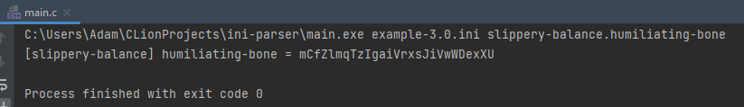
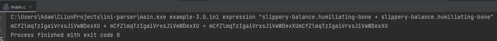

# ini-parser

course: Computer architecture with low-level programming

[Project Website](https://www.cs.put.poznan.pl/tzok/public/cawllp-02-ini.html)

[Project Description](project_description.pdf)

- text files
- dynamic memory allocation
- creating dynamic structures using `struct` and `typedef`

## Running with Project Arguments

### Reading Attribute

`[filename].ini [section].[key]`

### Expression Evaluation

`[filename].ini [section].[key] [*/+-] [filename].ini [section].[key]`

